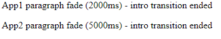
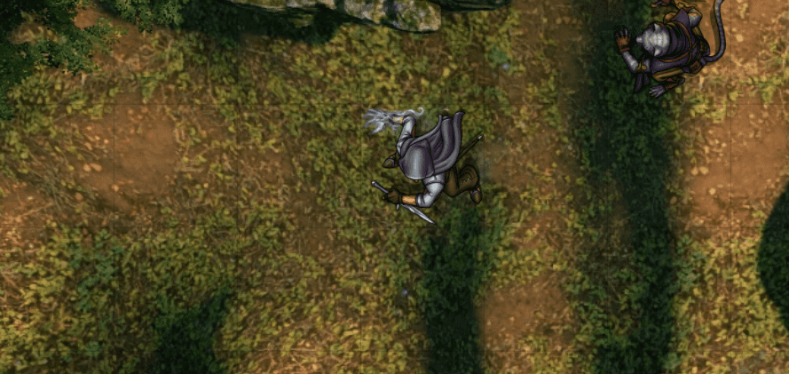

# test-multiple
Problem: When loading multiple separate compiled [Svelte](https://svelte.dev/) apps on the same page in the browser 
there is a conflict between the bundled Svelte internal runtime implementations that is most evident in transitions. If 
both independent Svelte apps transition elements at the same time the first component to finish will affect the second 
ongoing Svelte app / component cancelling the second app / component transition. This occurs even though both compiled 
Svelte apps are completely independent and have no overlapping components. Alas, top-level ES Module separation of 
the Svelte app / bundles does not prevent side effects.

Test case: This repo demonstrates the phenomenon with a very minimal set of Svelte apps / basic component that are
independently compiled and both mounted in `public/index.html`. Each independent app loads appends a `
` tag in 
`document.body` that has a fade transition. The first app has a duration of two seconds while the other app has a 
duration of five seconds. When the first app transition finishes at two seconds it affects the other app seemingly 
canceling the five second transition. A further update is posted using the `on:introend` event binding to show that 
internal timing aspects are not seemingly shared.

Snapshot of this demo:

Desired / expected result: Both Svelte apps function independently without one affecting the other. IE in this 
simple demo case this would result in a two second transition for the first Svelte app and a five second transition of 
the other Svelte app with no side effects between them.

Installation: This repo is self-contained and already has the compiled Svelte components located in `./public`. Simply
open a browser with `./public/index.html`. There is not much to the demo, so the snapshot above entirely captures the 
scenario at hand. There is a `build` NPM script to bundle the apps as necessary.

-------------------------------

Background: I am releasing a [component library / The TyphonJS Runtime Library](https://github.com/typhonjs-fvtt-lib/typhonjs) 
for [Foundry VTT](https://foundryvtt.com/) that integrates Svelte and provides a component library to build Svelte 
powered 3rd party Foundry packages. Foundry VTT is a virtual table-top for running all sorts of role playing games 
online and features a 3rd party API where many independent developers create add on modules and game systems; further 
referenced to as `FVTT packages`. That multiple FVTT packages can not independently compile and use Svelte at the same 
time is a major blocker for usage of Svelte on the Foundry VTT platform. 

Example snapshot of the same transition conflict between two independently compiled Svelte FVTT packages in this case
both of these apps are opening with a scale transition on startup. The app on the left has a 250ms scale duration and
the app on the right has a two second scale duration; the left app interrupts the independent right app:

Potential fix: Create a shared runtime. It is possible to create a `library module / package` on Foundry VTT that 
exposes a shared Svelte runtime that multiple FVTT packages can link against. I have already completed an 
implementation fully proving that this is possible with 
[custom Rollup plugins](https://github.com/typhonjs-fvtt-lib/typhonjs/tree/main/.rollup) for bundling the shared 
library package and another plugin used when linking a package against the shared runtime. However, I plan to 
release the component library with both the option for 3rd party developers to accept this dependency or independently 
bundle the library and Svelte separately.

Drawbacks / downside to a shared runtime:
- Fragile to changes in Svelte versions. Since future conflicting Svelte versions are not known in advance it is 
necessary to set a strict peer dependency version for Svelte during development when compiling against the shared 
runtime.

- As the library module releases new versions duplicates of the entire shared runtime need to be stored in perpetuity. 
This is very inconvenient during initial build out of the expanded component library and extra resources that eventually
will be added over the next 3-6 months. IE my plan was to start versioning the shared runtime when it hits
`1.0.0` and not out of the gate while more development occurs. I plan to include Svelte Cubed / Three.js and a PixiJS 
Svelte library as well; Foundry uses PixiJS for the main game canvas.

- Not everyone may be interested in using or aware of the shared runtime. There are thousands of 3rd party developers
making packages for Foundry VTT. All it takes is anyone else distributing a FVTT package not using the shared runtime to 
potentially foul things up. There already are a handful of Svelte powered FVTT packages in the wild on the FVTT 
platform. 

For prior discussion of creating shared Svelte runtimes see
[svelte/issues/3671](https://github.com/sveltejs/svelte/issues/3671).

Proof of concept that the shared runtime works. Please see the picture below showing the same two FVTT packages linked
against the shared runtime. These are the same two FVTT packages as the above example except linked to the shared 
runtime. The 250ms transition does not end the 2 second transition of the app on the right. 

Resolution: Well, it looks like I'm going to get very familiar with the Svelte internals over the next X weeks. This is
a major showstopper for utilizing Svelte on a shared / large platform like Foundry VTT. I can use whatever guidance and
help in debugging and providing a significant contribution to Svelte making it possible to have multiple independent
Svelte apps running on a single browser page. You can reach me on Discord at `MLeahy#4299`.
